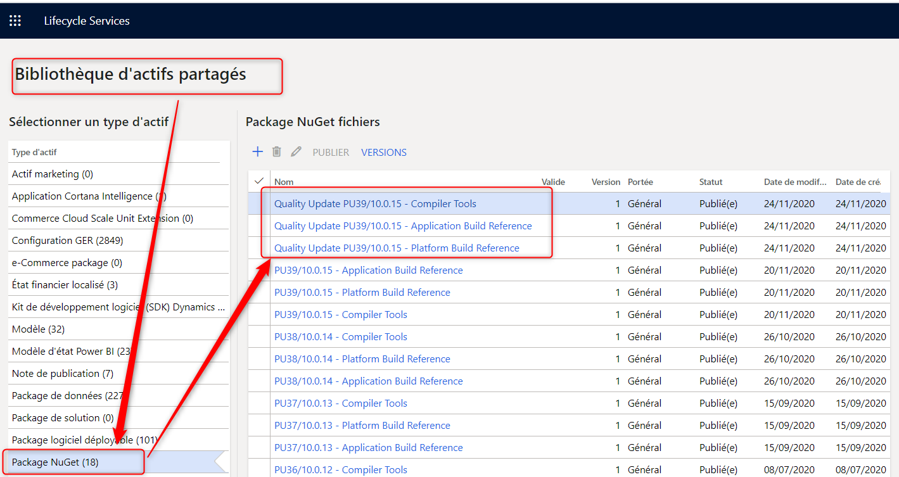

# Microsoft Hosted Build

## Update build version

### Get LCS assets



### Create nuget.config file

``` XML
<?xml version="1.0" encoding="utf-8"?>
<configuration>
  <packageSources>
    <clear />
    <add key="AASBuild" value="https://pkgs.dev.azure.com/aariste/aariste365FO/_packaging/AASBuild/nuget/v3/index.json" />
  </packageSources>
</configuration>
```

### Install the credential provider

<https://raw.githubusercontent.com/microsoft/artifacts-credprovider/master/helpers/installcredprovider.ps1>

Execute de script with "-AddNetfx" parameters

``` PowerShell
./installcredprovider.ps1 -AddNetfx
```

### Upload Nuget Package to feed

``` PowerShell
.\nuget.exe push -Source "XXXBuildD365FO" -ApiKey az "C:\temp\nuget\microsoft.dynamics.ax.application.devalm.buildxpp.10.0.644.10018.nupkg"
.\nuget.exe push -Source "XXXBuildD365FO" -ApiKey az "C:\temp\nuget\Microsoft.Dynamics.AX.Platform.CompilerPackage.7.0.5816.35654.nupkg"
.\nuget.exe push -Source "XXXBuildD365FO" -ApiKey az "C:\temp\nuget\Microsoft.Dynamics.AX.Platform.DevALM.BuildXpp.7.0.5816.35654.nupkg"
```

### Update package.config on Devops repository

## Links

<https://ariste.info/en/2020/05/azure-hosted-build-dynamics365-finance-scm/>
